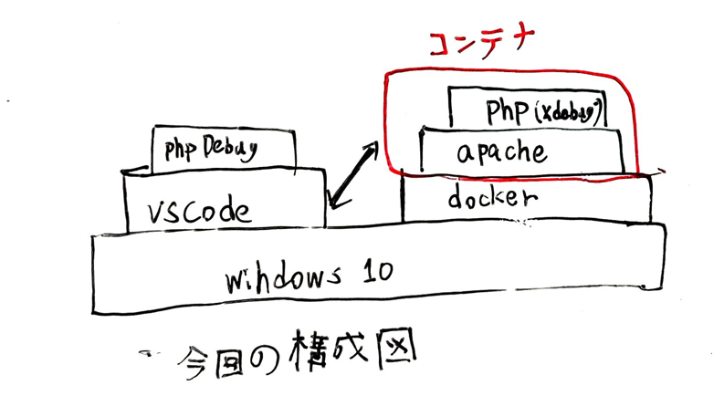
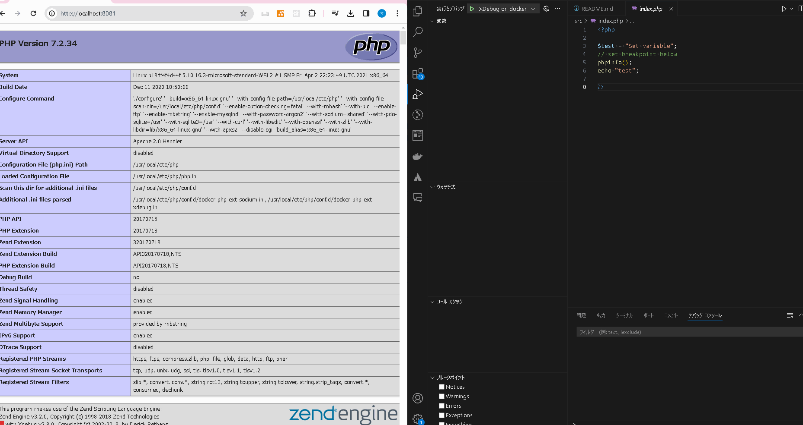

# 概要
VscodeでXDebug2を使うための設定を行いました。
Dockerを使っています。

※macでの確認はしていません。

# 開発環境



名称|バージョン|説明
---|----|----
Docker|24.0.6|コンテナ型仮想環境
Windows|10|OS
XDEBUG|2.2.5|PHP用のデバッグ用の拡張機能
VSCODE|1.85.1|IDE
PHP Debug|1.34.0|VSCODEでXdebugを使えるエクステンション。

# dockerの起動方法

```bash
# dockerコンテナをビルドする
docker-compose build

# dockerコンテナを起動する
docker-compose up -d

```

# vscodeの操作

## 操作
デバッグタブを開く。

デバッグを実行する

以下URLを開く。
http://localhost:8081/

breakpointが止まることを確認する。

以下gif動画で動かしたときの様子。



# 参考

https://qiita.com/gigosa/items/90431be7a6a79db78480